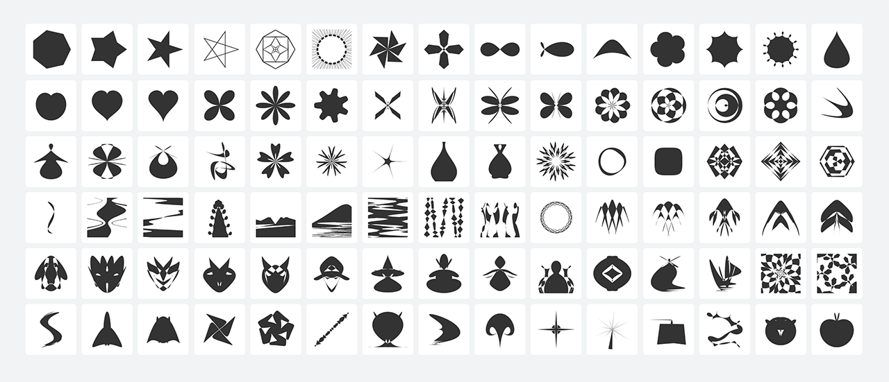

# Shapes

A tool for discovering new CSS polygon shapes generated
with [css-doodle](https://css-doodle.com) `@shape` function and mathematical expressions.
The shape is defined with [polar equations](https://en.wikipedia.org/wiki/Polar_coordinate_system) or [cartesian equations](https://en.wikipedia.org/wiki/Cartesian_coordinate_system).

 
 

### Available commands
* `fill-rule`:  nonzero | evenodd;
* `split`: number between 3 - 2400;
* `rotate`: number in degree;
* `scale`: number for scale factor;
* `origin`: a pair of value for setting coordinate origin;
* `x`: x coordinate for cartesian equation;
* `y`: y coordinate for cartesian equation;
* `r`: polar equation;

### Operations

* Operations available: `+`, `-`, `*`, `/`, `%`, '^'
* All JavaScript Math functions and constants can be used. Such as `sin`, `cos`, `tan`, `PI` or `π` etc.

### Website

[https://css-doodle.com/shapes](https://css-doodle.com/shapes)
